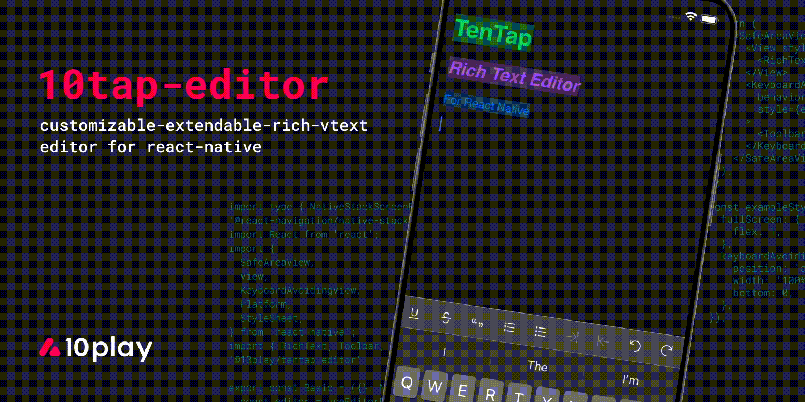

# 10tap-editor

TenTap is a typed, easy to use, customizable, and extendable Rich Text editor for React-Native based on Tiptap and Prosemirror. It offers a "plug and play" experience and comes with many essential features out of the box that can be incorporated into your apps quickly. Additionally, TenTap allows you the developers to tailor the editor to your applications specific needs.



<br />
<br />
# Features

- 💁 Based on tiptap
- ➕ Exstanabily
- 🎹 Custom keyboards
- ⚙️ Support dynamic scheme
- 🛠️ Native toolbar
- 💅 Customizable styles
- 🌒 Pre-made darkmode theme

## Why?

After years of developing rich text editors for mobile, we realized that there is an empty void for open source RichText editors on mobile especially for ReactNative. So we have decided to create this package that incorporates all that we have learned, and that provides the best possible ux. Tentap is designed for getting the best experience of editing rich-text on mobile inspired by state of the art mobile editors like: gdocs, notion, dropbox paper.

# Docs and Examples

[Click Here For Full Documentation](https://10play.github.io/10tap-editor/docs/intro.html)

# Installation

## React Native

1. `yarn add @10play/tentap-editor react-native-webview`
2. `cd ios && pod install`

## Expo

`npx expo install @10play/tentap-editor react-native-webview`  
Only basic usage without custom keyboard is supported by Expo Go (see [basic example](../examples/basic.md)).  
Otherwise you will need to setup [Expo Dev Client](https://docs.expo.dev/develop/development-builds/introduction/).

Now you ready to add tentap to your app!

## Usage

```tsx
export const Basic = () => {
  const editor = useEditorBridge({
    autofocus: true,
    avoidIosKeyboard: true,
    initialContent,
  });

  return (
    <SafeAreaView style={{ flex: 1 }}>
      <View style={{ flex: 1 }}>
        <RichText editor={editor} />
      </View>
    </SafeAreaView>
  );
};
```

## Contributing

See the [contributing guide](CONTRIBUTING.md) to learn how to contribute to the repository and the development workflow.

## License

MIT

---

Made with [create-react-native-library](https://github.com/callstack/react-native-builder-bob)
